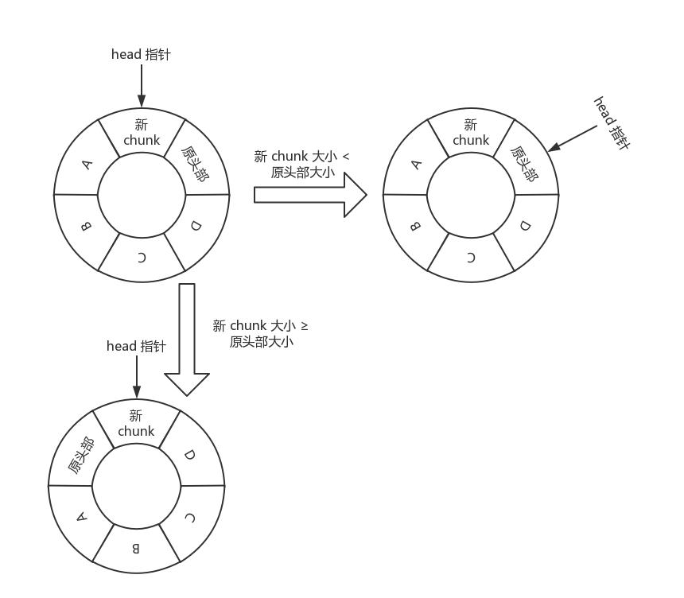
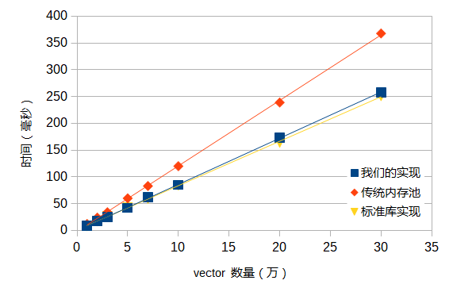
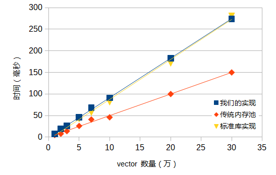
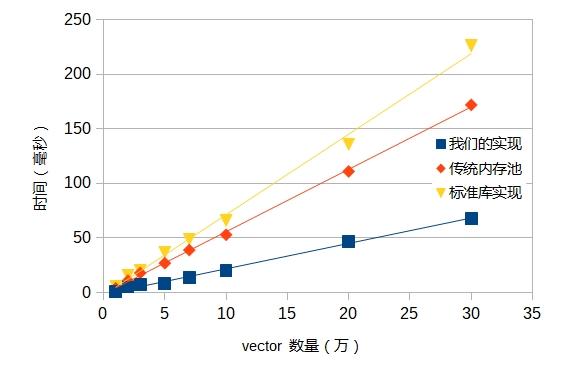

# My Allocator
这是一个简单而较为高效的 C++ Allocator，基于内存池实现。

（这也是一个《面向对象编程》的课程大作业，虽然我不知道为什么 OOP 的大作业是写内存池...）

Allocator 的内存分配算法借鉴了[这个项目](https://github.com/eapache/wof_alloc)的思路，以下简要介绍本 Allocator 的内存分配方式。

## 核心思路
Allocator 的接口要求中，我们需要每次分配不固定大小的内存。传统的内存池虽然能够解决“内存碎片”的问题，但传统内存池每次分配的内存大小是固定的。当然，我们可以通过估计每个 vector 的最大内存使用量，每次都分配最大可能使用内存，但这样会造成大量的内存浪费。所以，我们需要对传统内存池进行改进，使用一个新的内存池实现方式。

### Block 与 Chunk
我们称内存池向操作系统申请的一大块内存为 block。传统的内存池在接收到内存申请后，会直接把整个 block 分配出去；但我们使用的方法中，会根据需要分配的内存大小，从 block 的头部“切下”一块内存分配出去，称“切下”的这一块内存为 chunk。

### 内存分配方式
为了维护内存池中当前可用的 chunk，我们将所有可用的 chunk 放进一个循环双向链表中。每次分配内存时，我们尝试“切下”链表头部的一块分配出去。如果链表头部的大小不能满足申请者的要求，我们再向操作系统申请一块新的 block。为了加快申请速度，新 block 的大小被设置为一个常数 BLOCK_SIZE（一般为 4096 或 8192）的整数倍。

为了减少向操作系统申请内存块的次数，我们需要将尽量大的 chunk 移动到链表头部。当一个新的 chunk 从头部插入链表（成为新的链表头部）后，我们使用以下方式维护链表，如下图所示。

- 如果新 chunk 的大小比原链表头部小，则将链表头部重新设为原头部；
- 如果新 chunk 的大小大等于原链表头部，则将原链表头部插入到新头部的上一个位置。

这样的维护方式具有以下容易证明的特性：

- 维护次数越多，最大的 chunk 越有可能被移动到头部；
- 如果维护次数大等于链表长度，则最大的 chunk 必然位于链表头部。

### 内存释放方式
使用者释放内存后，内存对应的 chunk 就被插入到链表的头部，并进行链表更新。

为了不产生内存地址中（不是链表中）连续的可用 chunk（这样才能让可用 chunk 的大小尽量大），我们在将一个 chunk 设为可用时，需要检查内存地址中的前一个 chunk 和后一个 chunk 是否可用。如果可用则进行合并。

用归纳法容易证明，这样维护不会产生连续的可用 chunk。

## 测试结果
为了测试内存池实现的正确性与效率，我们对内存池进行了测试。同时，为了与传统的内存池进行对比，我们使用了 github 上一个固定大小的传统内存池实现（[点此查看](https://github.com/cacay/MemoryPool)）进行时间与空间上的对比。

各测试程序均由 g++ 编译，并开启 -O2 优化开关。

我们对新建 vector、vector 大小调整与释放 vector 三个操作进行了测试。每次新建或调整大小的 vector，大小取 1 ~ 1000 内的随机数。

↑ 新建 vector 内存申请速度

↑ vector 调整大小速度

↑ 释放 vector 处理速度

可以看到，我们的实现在 vector 申请与改变大小的过程中，速度与标准库实现非常相近。传统内存池由于每次都会将整块内存进行分配，造成了一定的内存浪费，所以需要较多次地向操作系统申请内存，所以传统内存池的申请速度是比较缓慢的。不过，传统内存池在 vector 改变大小的操作下略占优势，因为传统内存池不需要进行 chunk 的合并等操作，可以直接把刚刚释放的内存再划给申请者，所以我们的实现在 vector 改变大小的操作下略有劣势。

但是，我们的实现在 vector 的释放中速度是非常快的。这是因为我们的实现方法中，申请的 block 数较少，且相邻 chunk 会进行合并，减少了链表内元素的数量，这一点是传统内存池实现所不能做到的。另外，传统内存池每次分配的内存大小是固定的，如果随机数的范围再次增大，传统内存池就不再适用了。
